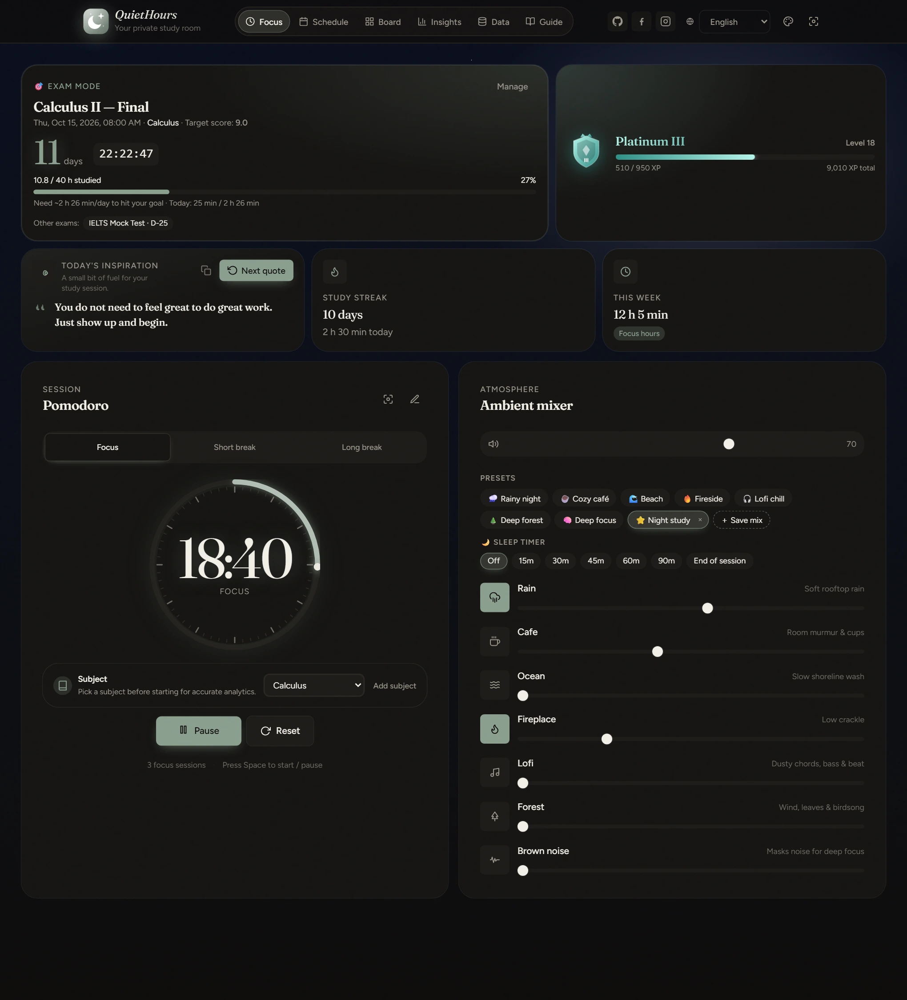
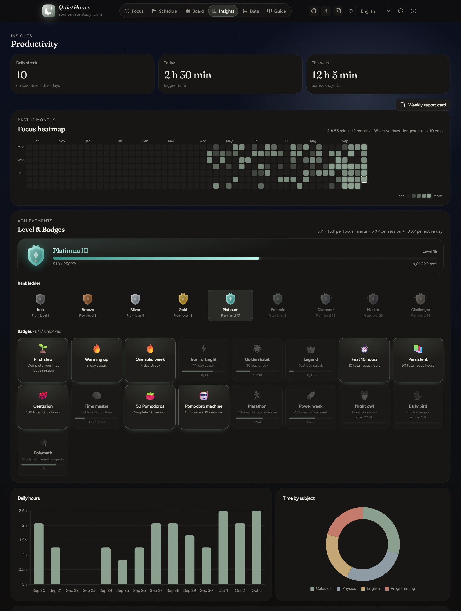
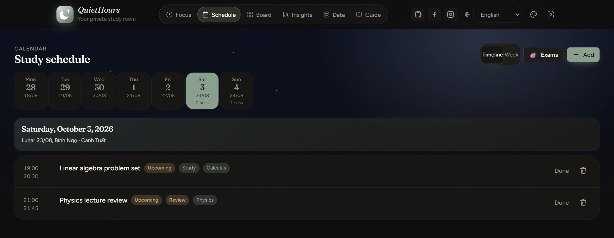
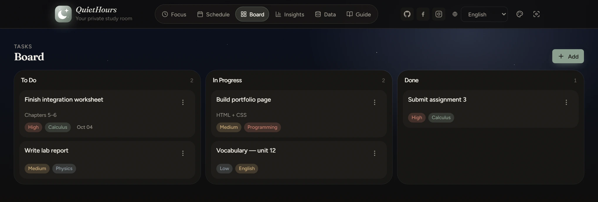
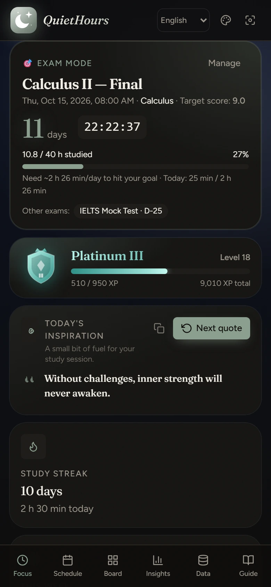

<div align="center">

# 🌙 QuietHours

**Phòng học cá nhân yên tĩnh ngay trong trình duyệt của bạn.**<br>
Pomodoro · nhạc nền · lịch học · bảng việc · thống kê · đếm ngược kỳ thi — không máy chủ, không tài khoản, không cần build.

[](https://s1gnuh.github.io/QuietHours-Pomodoro-SelfStudy/)
[](LICENSE)
[](#-bắt-đầu)

[English](README.md) · **Tiếng Việt**



</div>

---

## Mục lục

- [Vì sao có QuietHours](#-vì-sao-có-quiethours)
- [Tính năng](#-tính-năng)
- [Ảnh chụp màn hình](#-ảnh-chụp-màn-hình)
- [Bắt đầu](#-bắt-đầu)
- [Triển khai lên GitHub Pages](#-triển-khai-lên-github-pages)
- [Cách tính XP và rank](#-cách-tính-xp-và-rank)
- [Phím tắt](#-phím-tắt)
- [Dữ liệu và quyền riêng tư](#-dữ-liệu-và-quyền-riêng-tư)
- [Công nghệ](#-công-nghệ)
- [Cấu trúc dự án](#-cấu-trúc-dự-án)
- [Đóng góp](#-đóng-góp)
- [Tác giả](#-tác-giả) · [Bản quyền](#-bản-quyền)

## ✨ Vì sao có QuietHours

Phần lớn ứng dụng học tập đều đòi tài khoản, gói đăng ký hoặc dữ liệu của bạn. QuietHours làm ngược lại: **một trang web tĩnh** mở ở đâu cũng được, lưu mọi thứ ngay trong trình duyệt của bạn và không làm phiền bạn.

- 🔒 **Riêng tư từ thiết kế** — không dữ liệu nào rời khỏi máy bạn. Không phân tích, không theo dõi, không máy chủ.
- ⚡ **Không cần cài đặt** — HTML, CSS và JavaScript thuần. Mở `index.html` là học được ngay.
- 🎧 **Không có file âm thanh** — mọi âm thanh nền đều được tổng hợp trực tiếp bằng Web Audio API.
- 🌐 **Song ngữ** — giao diện tiếng Việt và tiếng Anh, đổi bằng một cú nhấp.

## 🚀 Tính năng

### Tập trung
| | |
|---|---|
| 🍅 **Bộ đếm Pomodoro** | Chu kỳ Tập trung / Nghỉ ngắn / Nghỉ dài, tự chạy phiên tiếp, tùy chỉnh thời lượng, đồng hồ vòng tròn phát sáng. Mỗi phiên hoàn thành được ghi theo môn học. |
| 🔔 **Chuông kết thúc phiên** | 5 loại chuông tổng hợp (Chime, Chuông tháp, Tibetan Bowl, Digital, Chim hót), lặp 1–5 lần, có nút nghe thử. |
| 🧘 **Chế độ Zen** | Toàn màn hình, không xao nhãng: chỉ còn đồng hồ. Nhấn `Esc` để thoát. |
| 💬 **Câu nói hằng ngày** | 200 câu cảm hứng song ngữ, có bộ dự phòng khi không tải được. |

### Không gian
| | |
|---|---|
| 🌧️ **Bộ trộn nhạc nền** | 7 kênh stereo sinh bằng thuật toán — **Mưa** (giọt mưa, máng xối, sấm xa), **Quán cà phê** (tiếng người nói, cốc chén), **Biển** (từng con sóng có bọt), **Lò sưởi** (củi nổ lách tách), **Lofi** (hợp âm, bass, trống, tiếng đĩa than), **Rừng** (gió và chim hót) và **Ồn nâu**. Reverb dùng chung và bộ nén giúp âm thanh sạch khi bật nhiều kênh. |
| 🎛️ **Preset** | 7 bản phối dựng sẵn (Mưa đêm, Quán quen, Bờ biển, Lò sưởi, Lofi chill, Rừng sâu, Tập trung sâu) và **preset do bạn tự lưu**. |
| 🌙 **Hẹn giờ tắt** | Nhạc nhỏ dần rồi tắt sau 15 / 30 / 45 / 60 / 90 phút, hoặc khi hết phiên hiện tại. |
| 🌅 **Nền theo giờ** | Bầu trời đổi từ bình minh đến đêm, có quầng sáng mặt trời/mặt trăng di chuyển và sao lấp lánh. |
| 🎨 **5 bộ giao diện** | Sage, Sunset, Lavender, Ocean, Cyber — logo, biểu đồ và thẻ rank đổi màu theo theme. |

### Lên kế hoạch & theo dõi
| | |
|---|---|
| 🎯 **Chế độ thi** | Thêm kỳ thi với ngày, giờ, môn, mục tiêu giờ ôn và điểm mục tiêu. Đếm ngược chạy ngay trên màn hình chính, chuyển vàng/đỏ khi ngày thi đến gần và cho biết mỗi ngày cần học bao nhiêu. |
| 📅 **Lịch học** | Xem theo ngày và theo tuần, tích hợp **Lịch Vạn niên Việt Nam** (thuật toán Hồ Ngọc Đức). |
| 📋 **Bảng Kanban** | Cần làm → Đang làm → Hoàn thành, kéo thả, có mức ưu tiên, hạn chót và môn học. |
| 🗺️ **Bản đồ chăm chỉ** | Lịch 12 tháng kiểu GitHub thể hiện số phút tập trung mỗi ngày. |
| 📊 **Thống kê** | Biểu đồ giờ học theo ngày, biểu đồ tròn theo môn và lịch sử phiên có thể sửa. |
| 🪪 **Thẻ tổng kết tuần** | Xuất ảnh Story 9:16 (PNG) để chia sẻ thành tích tuần. |

### Động lực
| | |
|---|---|
| 🏆 **XP, cấp độ & rank** | Mỗi phút tập trung đều cho XP; leo qua 9 bậc — Sắt → Đồng → Bạc → Vàng → Bạch Kim → Lục Bảo → Kim Cương → Cao Thủ → Thách Đấu. |
| 🏅 **17 huy hiệu** | Chuỗi ngày, tổng giờ học, marathon, phiên sớm / khuya… mỗi huy hiệu có thanh tiến độ. |
| 🎉 **Ăn mừng** | Pháo giấy và thông báo khi hoàn thành phiên, lên cấp hoặc mở khóa huy hiệu. |
| 👋 **Hướng dẫn lần đầu** | Popup 6 bước song ngữ (xem lại được ở tab Cảm ơn & HD). |

## 🖼️ Ảnh chụp màn hình

<table>
  <tr>
    <td width="50%"><br><sub><b>Thống kê</b> — bản đồ chăm chỉ, bậc rank, huy hiệu và biểu đồ</sub></td>
    <td width="50%"><br><sub><b>Lịch học</b> — thanh tuần, ngày âm lịch và danh sách buổi học</sub></td>
  </tr>
  <tr>
    <td width="50%"><br><sub><b>Bảng việc</b> — Kanban kéo thả với mức ưu tiên và môn học</sub></td>
    <td width="50%" align="center"><br><sub><b>Di động</b> — bố cục responsive với thanh điều hướng dưới</sub></td>
  </tr>
</table>

## 🏁 Bắt đầu

QuietHours là trang web tĩnh — không cần cài gì cả.

**Cách 1 — dùng online**

👉 **<https://s1gnuh.github.io/QuietHours-Pomodoro-SelfStudy/>**

**Cách 2 — chạy trên máy**

```bash
git clone https://github.com/s1gnuh/QuietHours-Pomodoro-SelfStudy.git
cd QuietHours-Pomodoro-SelfStudy

# dùng server tĩnh bất kỳ, ví dụ:
python -m http.server 8765        # Python 3
# hoặc
npx serve .                       # Node.js
```

Sau đó mở <http://127.0.0.1:8765/>.

> Bạn cũng có thể nhấp đúp `index.html`. Khi đó câu nói hằng ngày dùng bộ dự phòng có sẵn (trình duyệt chặn `fetch` trên `file://`), và âm thanh chỉ bắt đầu sau lần nhấp đầu tiên — quy tắc chung của trình duyệt với âm thanh web.

## 🌍 Triển khai lên GitHub Pages

1. Đẩy repository lên GitHub.
2. Vào **Settings → Pages**.
3. Ở mục **Build and deployment**, chọn **Deploy from a branch**, chọn nhánh `main` và thư mục `/ (root)`, rồi lưu.
4. Trong vòng 1–2 phút, trang sẽ chạy tại `https://<tên-người-dùng>.github.io/<tên-repo>/`.

Không cần pipeline build. Mọi đường dẫn tài nguyên đều là đường dẫn tương đối nên ứng dụng cũng chạy được trong thư mục con.

## 🧮 Cách tính XP và rank

```
XP = 1 × số phút tập trung  +  5 × số phiên hoàn thành  +  10 × số ngày có học
```

Mỗi cấp cần `100 + 50 × (cấp − 1)` XP. Cứ **4 cấp** bạn lên một rank, mỗi rank có 4 hạng (IV → I). **Thách Đấu** là bậc cao nhất.

| Rank | Từ cấp | Rank | Từ cấp |
|---|---:|---|---:|
| Sắt | 1 | Lục Bảo | 21 |
| Đồng | 5 | Kim Cương | 25 |
| Bạc | 9 | Cao Thủ | 29 |
| Vàng | 13 | Thách Đấu | 33 |
| Bạch Kim | 17 | | |

Ước lượng: **học đều 2 giờ tập trung mỗi ngày sẽ lên Vàng sau khoảng một tháng**.

## ⌨️ Phím tắt

| Phím | Chức năng |
|---|---|
| `Space` | Bắt đầu / tạm dừng bộ đếm (bỏ qua khi đang mở hộp thoại hoặc nhập văn bản) |
| `Esc` | Đóng hộp thoại đang mở, hoặc thoát chế độ Zen |

## 🔐 Dữ liệu và quyền riêng tư

- Mọi thứ — phiên học, lịch, bảng việc, kỳ thi, preset và cài đặt — được lưu trong **`localStorage`** của trình duyệt, dưới khóa `quiethours-static-v1` (cùng vài khóa nhỏ cho ngôn ngữ, theme và hướng dẫn).
- **Không có gì được gửi tới máy chủ.** Các yêu cầu mạng duy nhất là hai thư viện CDN công khai (Chart.js, html2canvas) và Google Fonts — xem mục Công nghệ.
- Xóa dữ liệu trang, đổi trình duyệt hoặc đổi máy sẽ **làm mất dữ liệu**. Hãy dùng **Dữ liệu → Xuất dữ liệu** để tải file sao lưu JSON và **Nhập dữ liệu** để khôi phục. File sao lưu từ phiên bản cũ được nâng cấp tự động.

## 🧰 Công nghệ

| Thành phần | Lựa chọn |
|---|---|
| Giao diện | HTML5 và CSS thuần (biến CSS cho 5 bộ theme) |
| Logic | JavaScript ES6 thuần — không framework, không bundler, không transpiler |
| Âm thanh | Web Audio API, hoàn toàn procedural (oscillator, noise lọc, reverb convolution) |
| Biểu đồ | [Chart.js 4.4.1](https://www.chartjs.org/) (CDN) |
| Xuất ảnh | [html2canvas 1.4.1](https://html2canvas.hertzen.com/) (CDN) |
| Phông chữ | Google Fonts — Figtree và Fraunces |
| Lưu trữ | `localStorage` |
| Hosting | Mọi host tĩnh; khuyên dùng GitHub Pages |

## 📂 Cấu trúc dự án

```
QuietHours-Pomodoro-SelfStudy/
├── index.html            # Khung ứng dụng, các màn hình và hộp thoại
├── css/
│   ├── styles.css        # Hệ thống thiết kế, bố cục, theme, responsive
│   ├── effects.css       # Chuyển động và hiệu ứng thị giác (aurora, đồng hồ phát sáng, ripple)
│   └── features.css      # Heatmap, rank, chế độ thi, preset nhạc, bầu trời
├── js/
│   ├── app.js            # Lõi: state, timer, engine âm thanh, biểu đồ, i18n, lịch âm, onboarding
│   ├── effects.js        # Hiệu ứng: aurora, vạch chia đồng hồ, pháo giấy, thông báo
│   └── features.js       # Heatmap, XP / rank / huy hiệu, chế độ thi, preset, hẹn giờ tắt, bầu trời
├── data/quotes.json      # 200 câu nói song ngữ
├── docs/screenshots/     # Ảnh dùng trong README
├── LICENSE
├── README.md
└── README.vi.md
```

`features.js` và `effects.js` là các module bổ sung: chúng chỉ giao tiếp với `app.js` qua một cầu nối `window.QH` nhỏ và các sự kiện `qh:*`, nên có thể gỡ bỏ mà không ảnh hưởng phần lõi.

## 🤝 Đóng góp

Hoan nghênh issue và pull request.

1. Fork repo và tạo nhánh: `git checkout -b feature/y-tuong-cua-ban`
2. Giữ dự án không phụ thuộc thư viện — không build, không framework.
3. Kiểm thử trên trình duyệt nền Chromium và Firefox, ở cả kích thước desktop lẫn di động.
4. Mở pull request mô tả thay đổi và lý do.

**Ý tưởng trong lộ trình:** PWA cài được và dùng offline, nhắc sao lưu JSON, thông báo trình duyệt và giữ màn hình sáng, preset Pomodoro tùy chỉnh, thêm kênh nhạc nền.

## 👤 Tác giả

Tạo ra với ♥ bởi **Việt Hùng ([@s1gnuh](https://github.com/s1gnuh))**

[GitHub](https://github.com/s1gnuh) · [Facebook](https://www.facebook.com/viet.hung.183615/) · [Instagram](https://www.instagram.com/s1gnuh/)

## 📜 Bản quyền

Phát hành theo [Giấy phép MIT](LICENSE) — dùng tự do cho cá nhân hoặc thương mại.
